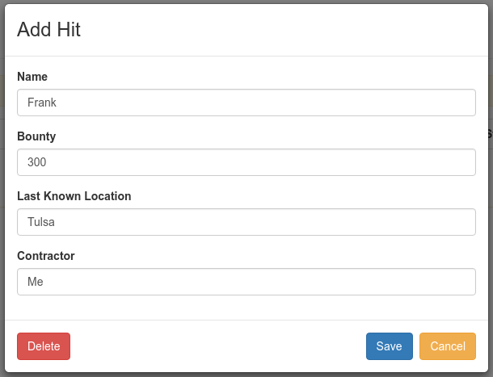

Homework for Thusday, July 14th (Due July 19th)
===============================================

Blog App: Add Post Author and Comments
--------------------------------------
Your homework will be to add a dropdown to select an author when creating each post and allow visitors to add comments to each blog post.  

To accomplish the first task, you will need to follow these basic steps:

- Create an `Author` model
- Manually add documents to our `authors` collection (since we won't have a front-end interface to add/edit authors)
- Add an `author` property to our `Post` model (don't forget the type needs to be `ObjectId` and to set `ref`)
- Add an express route to return all authors
- Add a select dropdown in the post modal that will display the author's name and use `_id` as the value
- Change the `/posts` route to populate `author`
- Display the author's name in the somewhere on the Blog

For the comments task:

- Add a property to store comments in our `Post` model (an array of objects, can simply be `name`,`body`, and `date`)
- Display and format the comments after each blog post on the client-side
- Add 'Add Comment' button and wire it up in the controller
- Create a new Comment modal (view and controller) for users to input their comments (the fields should match the `comments` structure that you added to the `Post` model)
- You will need to pass the post that the comment is being added to into the comment controller (`$uibModal.open()`'s `resolve` property)
- When the comment is saved: `push()` the comment into the `post.comments` array and POST the post to the server
- Close the modal using `$uibModalInstance.close()` after the server responds
- Refresh the list of posts to show the new comment (remember that `$uibModal.open()` returns an object that have a `result` Promise that we can use to know when the modal is closed)

The above list may seem pretty daunting at first, let's do something similar to our Hit List app step-by-step.

Hit List Example
----------------

Let's change our current Hit List app and make some improvements with what we've learned:

- Since the top 4 major contractors all use our app, let's change the Hit Contractor (text right now) to be a dropdown
- Let's let hitmen (hit-persons?) make *bids* on each hit

### Following Along
I created a [hitList github repo](https://github.com/sergei202/hitList) to make it easier to follow along.

If you want to follow along, clone the repo and check out the `modal` tag:

```bash
# Clone the repo
git clone https://github.com/sergei202/hitList
# Change into hitList directory
cd hitList
# Check out the modal branch and create a new branch called modal
git checkout -b modal modal
```
Install the required npm packages: `npm install`

Run: `node server.js`

### Add Contractor Support

#### Contractor Model
First we decide what data needs to be stored with each contractor document.  We only really need their name, but just for fun, let's also store their picture (as a url) so we can display their picture next to each hit.

Our documents will just consist of two properties:
```js
{
	name: 'Pablo Escobar',
	image: 'https://pbs.twimg.com/profile_images/603082303200301056/AFKWvroi_400x400.jpg'
}
```

We can now create our `Contractor` model, this will be saved in `models/contractor.js`:

```js
var mongoose = require('mongoose');

module.exports = mongoose.model('Contractor', {		// Create our Contractor model and export it
	name: String,
	image: String
});
```

#### Contractor Data
Since we already know the top 4 major contractors who use our app, let's have our app automatically generate the data if it doesn't already exist.

```js
function initContractors() {							// This function first checks if data exists and adds it if it doesn't
	return Contractor.count().then(function(count) {	// Count how many contractors are in our database
		if(count) return;								// If even one exists, don't create anymore and bail out.

		var contractors = [								// Define our list of contractors that we want inserted
			{name:'Pablo Escobar',	image:'https://pbs.twimg.com/profile_images/603082303200301056/AFKWvroi_400x400.jpg'},
			{name:'Al Capone',		image:'http://media.todaybirthdays.com/thumb_x256x256/upload/1899/01/17/al-capone.jpg'},
			{name:'John Dillinger',	image:'https://pbs.twimg.com/profile_images/632169869312589824/3lAuq8yn.jpg'},
			{name:'Frank Costello',	image:'http://p1.pstatp.com/large/5b10002c4ef3d28044c'}
		];

		contractors.forEach(function(contractor) {		// Loop through each element
			contractor = new Contractor(contractor);	// Create a document from our model
			return contractor.save();					// Save the document
		});
	});
}
```

We run this function every time our app starts, it only creates data if it doesn't exist.

#### Contractor Route
The only way for us to get data from the server-side to the client-side is by express routes.  Let's create a `/contractors` route to find and return all the contractors.

 ```js
 app.get('/contractors', function(req,res) {
 	Contractor.find().exec().then(function(contractors) {	// Find all contractors and then...
 		res.json(contractors);								// Respond with the list of contractors
 	});
 });
 ```

 Let's run our server and visit `http://localhost:8080/contractors`.  We should see:
 ```js
[
	{"_id":"578aeb6680e7a483300ed4c7","name":"Pablo Escobar","image":"https://pbs.twimg.com/profile_images/603082303200301056/AFKWvroi_400x400.jpg","__v":0},
	{"_id":"578aeb6680e7a483300ed4c9","name":"John Dillinger","image":"https://pbs.twimg.com/profile_images/632169869312589824/3lAuq8yn.jpg","__v":0},
	{"_id":"578aeb6680e7a483300ed4ca","name":"Frank Costello","image":"http://p1.pstatp.com/large/5b10002c4ef3d28044c","__v":0},
	{"_id":"578aeb6680e7a483300ed4c8","name":"Al Capone","image":"http://media.todaybirthdays.com/thumb_x256x256/upload/1899/01/17/al-capone.jpg","__v":0}
]
 ```

#### Following Along

We now have all the back-end code done to be able to list the contractors on the front-end!

You can checkout the `contractor-backend` tag to jump to this point in the tutorial:
```bash
# From the hitList directory that you cloned at the beginning
git pull
git checkout -b contractor-backend contractor-backend
```

#### Add Contractor Dropdown to Hit Modal
Our Hit modal currently looks like this:


Let's add a `<select>` dropdown to list all the contractors

[WIP]
